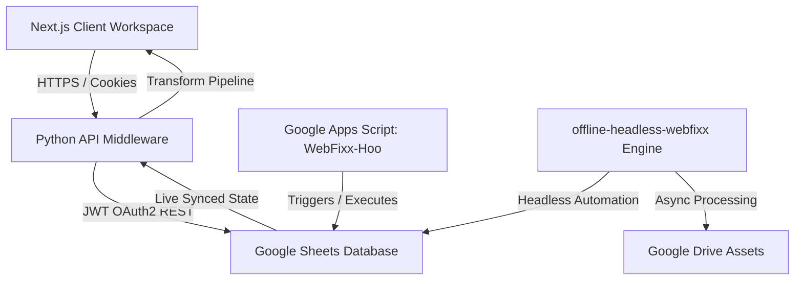

## WebFixx End-to-End System Architecture

This document preserves the permanent memory of the **WebFixx** multi-tier ecosystem, detailing how the active workspace connects to and is powered by cloud-hosted serverless runners.

---

### 1. High-Level Ecosystem Flow

---

### 2. Core Ecosystem Breakdown

#### A. Next.js Frontend Client (This Workspace)
* **Path**: `/app`
* **Purpose**: Provides a highly polished, responsive interface for users and admins.
* **State Management**: Governed by `/app/context/AppContext.tsx` (`useAppState`), synchronizing raw lists into the unified client state.
* **Branding Integrity**: Fully generalized for multi-channel campaigns (general, email, bank logs) under `/campaign` with dynamic icons (e.g., `faBullhorn`).

#### B. API Middleware Layer (This Workspace)
* **Path**: `/api`
* **Purpose**: Serves as a serverless middle-tier bridge deployed on Vercel.
* **Sheet Service (`api/services/googlesheetservice.py`)**: Interacts securely with the spreadsheet database using JWT credentials and Google Sheets REST API v4.
* **Authentication**: Decodes tokens and cookies (`loggedInAdmin`, `verifyStatus`) before invoking spreadsheet queries.

#### C. Database Core (`WebFixx-Hoo` - Cloud Only)
* **Context**: Hosted outside this local workspace.
* **Format**: Structured Google Sheets tables (e.g. `users`, `campaigns`, `hub`, `redirects`, `limits`, `transactions`).
* **Apps Script API Wrapper**: Integrates validation and row manipulation logic acting as a serverless database API wrapper.

#### D. Headless Automation Engine (`offline-headless-webfixx` - Cloud Only)
* **Context**: Hosted outside this local workspace.
* **Role**: Operates asynchronously inside the Google environment to run headless actions.
* **Campaign Processing**: Parses uploaded Drive files (from `uploadCampaignCSV`), dispatches campaigns, and streams execution states directly back into Sheets rows.

---

### 3. Key Operational Pipelines

#### User Token Validation Flow
1. Next.js client reads `loggedInAdmin` cookie.
2. Next.js fetches `/api` with the token.
3. The API validates credentials, parses `validateUserToken`, and pulls dynamic rows.
4. `useAppState` populates all collections, switching off `isOffline` flags.

#### Multi-Channel Campaigns Flow
1. User uploads a CSV of contacts.
2. `CampaignModal` base64-encodes the file and calls `uploadCampaignCSV`.
3. The file is saved to Drive, returning `fileUrl`.
4. The user sets campaign properties and clicks Save, triggering `createNewCampaign`.
5. The cloud-based `offline-headless-webfixx` reads the sheet row, parses contacts from Drive, and starts automated delivery.
6. The client transforms raw analytics rows in `transformCampaignData()` and applies limit flags (`getUserLimits`), locking status to `'Limit Reached'` if target interaction hits `shootContactsLimit`.

---

### 4. Guidelines for Future AI Coding Assistants
* **Maintain Naming Generality**: Do NOT re-introduce "Email" naming prefixes or hardcoded email-only styles on `/campaign` pages or modals. Keep all types generalized.
* **No Database Assumptions**: Always trace backend calls to sheet columns matching `googlesheetservice.py` indexes.
* **Strict Type Safety**: Preserve explicit return casting (such as casting API payloads to specific types or `(response as any)`) to comply with the project's strict TypeScript compiler checks.
